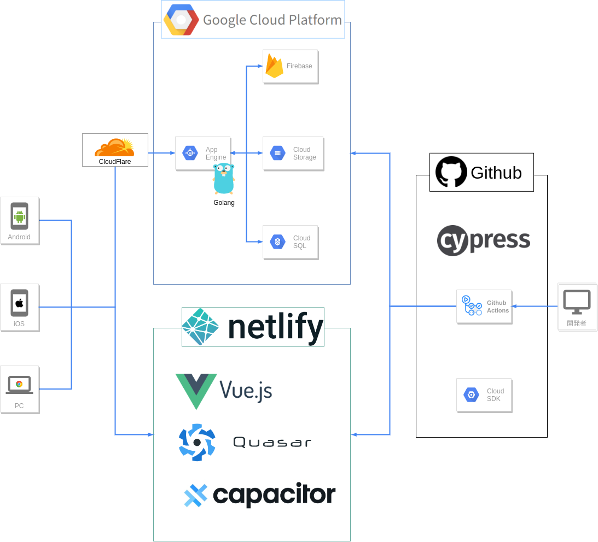

<h1 align="center">OGP Gallery</h1>

## フロント部分概要
このリポジトリには以下が含まれます
- Web版のSPAのコード
- Android/iOS版のCapacitorのコード
- テストコード(ユニットテストはJest / E2EテストはCypress)
- CI/CDのコード

## SPAについて
Vue製のフレームワークQuasarを利用してスピード重視で作成しました。
- [SPA部分のコード](https://github.com/go-u/ogp-gal-front/tree/master/src)
(QuasarはNuxtと同等以上の機能があります)

## Android/iOSアプリについて
両アプリともプッシュ通知に対応済みのベータ版として公開中です。
- [Androidのコード](https://github.com/go-u/ogp-front/tree/master/src-capacitor/android)
- [iOSのコード](https://github.com/go-u/ogp-front/tree/master/src-capacitor/ios)

### アプリ開発の補足
Cordova後継のCapacitorについて拙作のコミュニティプラグインを公開中です。
- [公式の掲載情報(Display > Keep Screen On に掲載)](https://capacitor.ionicframework.com/docs/community/plugins/#display)
- [拙作のCapacitorプラグインのリポジトリ(TypeScript/Java/Swiftを利用)](https://github.com/go-u/capacitor-keep-screen-on)

## テストについて
ユニットテストのサンプル
- [ユーザ名変更コンポーネントの'isValidUsername()'をテスト](https://github.com/go-u/ogp-front/blob/master/test/jest/__tests__/Regex.spec.js)

E2Eテストのサンプル
- [Firebaseを使ったログイン&ページ遷移が正常に行えるかのテスト](https://github.com/go-u/ogp-front/blob/master/test/cypress/integration/home/login_spec.js)
- 上記ログインテストの動画を以下のCI/CDにて自動保存

## CI/CDについて
- [プッシュ時にユニットテスト](https://github.com/go-u/ogp-front/blob/master/.github/workflows/test.yml)
- [プルリク時に自動デプロイ&E2Eテストを実行](https://github.com/go-u/ogp-front/blob/master/.github/workflows/deploy_staging.yml)
- [マージ時にプロダクション環境に自動デプロイ](https://github.com/go-u/ogp-front/blob/master/.github/workflows/deploy_production.yml)
(E2Eテストの動画はGithubに自動アップロードしています)
